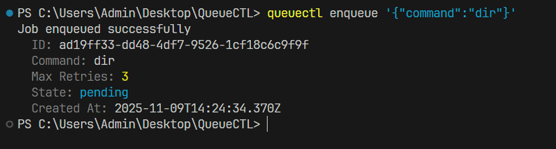
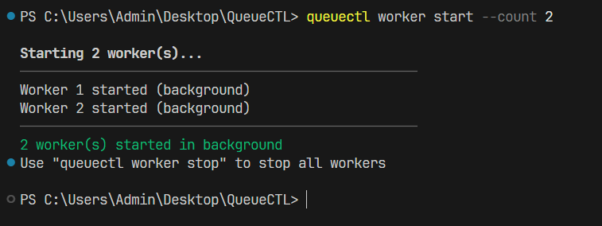
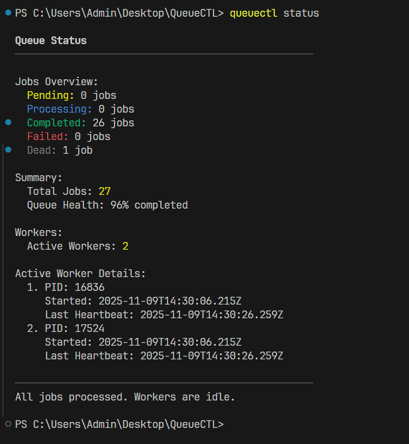
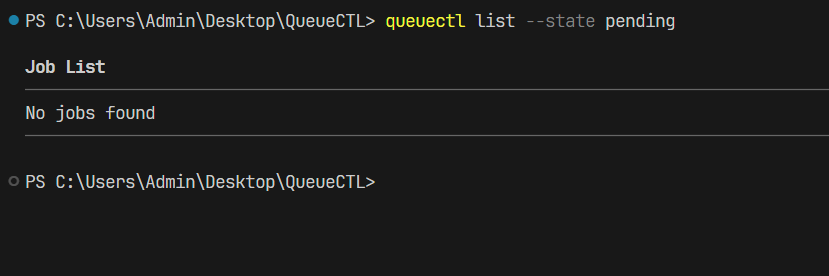
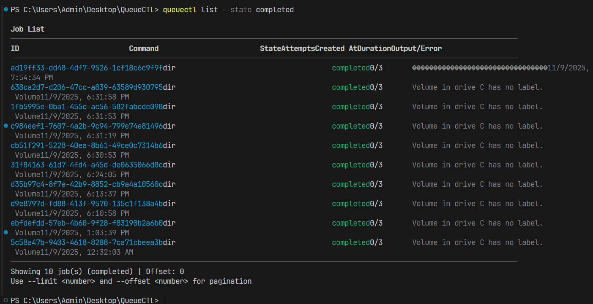
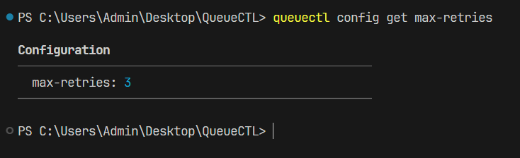
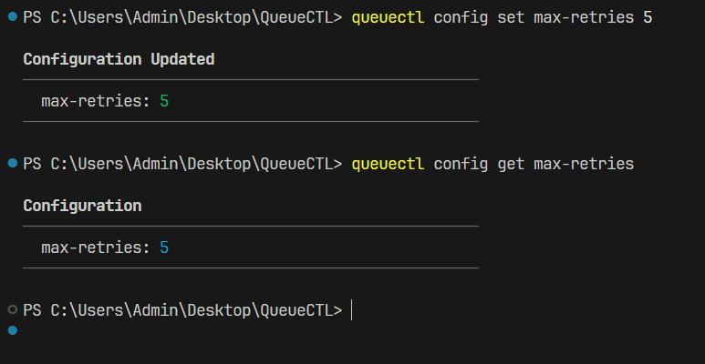
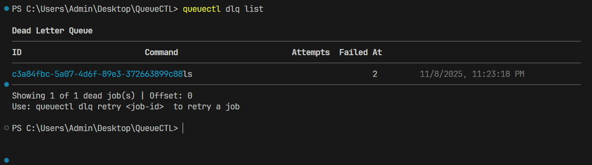
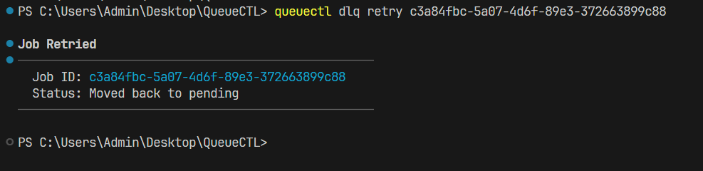

# QueueCTL

A CLI-based background job queue system built with Bun and TypeScript. QueueCTL manages background jobs with multiple worker processes, automatic retry logic using exponential backoff, and a Dead Letter Queue for permanently failed jobs.

## Features

- **Background Job Processing** - Queue and execute shell commands asynchronously
- **Multi-Worker Support** - Run multiple concurrent workers for parallel processing
- **Smart Retry Logic** - Automatic retry with exponential backoff (configurable)
- **Dead Letter Queue** - Capture and manage jobs that permanently fail
- **Persistent Storage** - SQLite database ensures jobs survive restarts
- **Job State Tracking** - Monitor jobs through their complete lifecycle
- **Configuration Management** - Customize retry behavior and backoff timing

## Prerequisites

- **Bun** v1.0.0 or higher ([Install Bun](https://bun.sh))
- **PowerShell** v7+ required ( winget install --id Microsoft.PowerShell --source winget )

## Installation

### Quick Install (Windows PowerShell) (Recommended)

```bash
git clone https://github.com/Nikhil-Pulluri/QueueCTL
cd queuectl
.\install.bat
```

## Note ( Very Important )

PowerShell v7+ is required for avoiding any JSON parsing errors in the CLI usage. Please check the version before using the CLI.

```bash
pwsh --version
```

You can install the latest version using the below command. Please reopen the powershell once updated.

```bash
winget install --id Microsoft.PowerShell --source winget
```

### Manual Installation

```bash
git clone https://github.com/Nikhil-Pulluri/QueueCTL
cd queuectl
bun install
chmod +x src/index.ts
bun link
queuectl --help
```

## Example Usage

### Enqueue a Job



### Start Worker(s)



### Check Status



### List Jobs






### Configuration Management





### Dead Letter Queue (DLQ)





### Stop Workers


## Demonstration Video

Please find the attached link for the video reference.

[Demo Video Link](https://www.loom.com/share/d58ce9d22e66483eb494704f42285aae)
